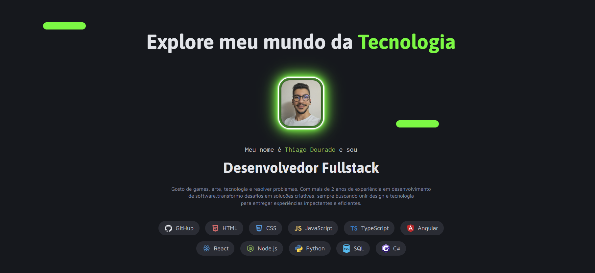
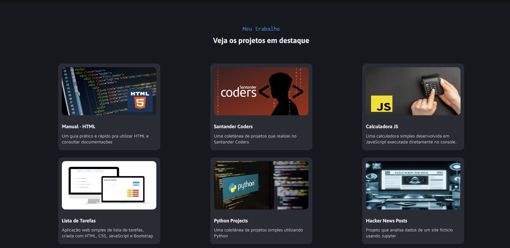

# Meu Portfólio




Bem-vindo ao meu portfólio pessoal! Este projeto contém informações sobre mim, minhas habilidades e alguns dos projetos em que já trabalhei. É também uma vitrine para os trabalhos que desenvolvi nas áreas de desenvolvimento web e análise de dados. A página também contém algumas referências a jogos que gosto muito.

## 🖥️ Sobre o Projeto

Este portfólio foi criado para compartilhar meus projetos e realizações. Ele inclui uma lista de projetos em destaque, uma breve biografia sobre mim e informações sobre minhas habilidades técnicas e criativas.

Você pode visitar meu portfólio online através do GitHub Pages [aqui](https://thiagodouradof.github.io/meu-portfolio/).

## 🚀 Tecnologias Utilizadas

- **HTML5**: Estrutura básica do site
- **CSS3**: Estilização e layout responsivo
- **JavaScript**: Interatividade e animações

## 📁 Estrutura do Projeto

```bash
├── index.html
├── script.js      
├── assets/             
│   ├── icons/
│   ├── images/
├── styles/           
│   ├── css/
└── README.md
```

## 🌟 Funcionalidades
Design Responsivo: O layout do site se adapta a diferentes dispositivos, desde smartphones até desktops.
Interatividade: Alguns projetos têm visualizações interativas para demonstrar minhas habilidades com JavaScript.

## 🔧 Como Executar Localmente
Se você quiser rodar o projeto localmente, siga estas instruções:

1.   Clone o repositório:

```bash
git clone https://github.com/seu-usuario/meu-portfolio.git
```
2. Navegue até o diretório do projeto:

```bash
cd meu-portfolio
```
3. Abra o arquivo index.html no navegador.

## 📬 Contato
Se você deseja saber mais sobre mim ou discutir algum projeto, sinta-se à vontade para entrar em contato!

Email: thiagodfontenla@gmail.com

LinkedIn: Thiago Dourado Fontenla

GitHub: @thiagodouradof